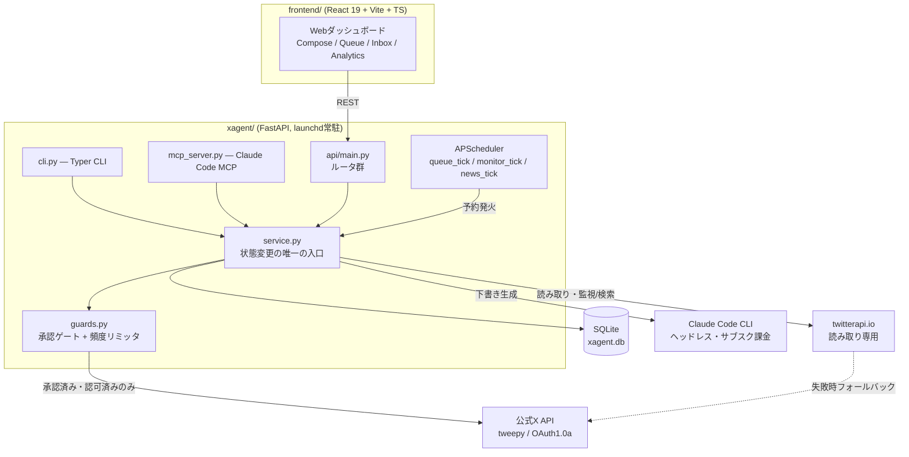

# XAgent

雑なメモを渡すとAIがあなたの口調に整形し、投稿ボタンを押す前に必ず人間の承認を待つ、半自動のX(Twitter)運用エージェント。

[English](README.md) | [日本語](README.ja.md) | [中文](README.zh.md)


## Why(なぜ作ったか)

個人のXアカウントを本気で運用するには、一貫した口調で頻繁に投稿し続ける必要があるが、それに一日中時間を費やすわけにはいかない。完全自動化ツールは時間の問題を解決する代わりに、もっと悪い問題を作る――無人でいいね・フォロー・RT・大量リプライを行うボットは、まさにXのスパム対策システムが検知しようとしている挙動そのものであり、アカウント凍結につながりうる。既存の「AI成長」ツールの多くは、速度と引き換えにこのリスクを許容している。

XAgentは逆の選択をする。AIには下書き作業(雑なメモを口調に整形する、リプライ案を作る、その日の絡み候補を選ぶ)を任せるが、実際にアカウントへ作用する操作はすべて人間の明示的な承認の後段に置く。あわせて、本当に地味で機械的な作業――Xの実際の加重文字数計算、長文のスレッド分割、投稿頻度の調整――もLLMに算数をやらせず自前で実装している。

## Features(主要機能)

- **下書き→承認→投稿を、慣習でなくコードで強制。** 全ての状態遷移(`draft → approved → queued → posted`、および reject/cancel)は明示的な許可リスト(`xagent/guards.py`)に照らして検証される。不正な遷移――未承認の下書きを投稿しようとする試みを含む――はX APIに届く前に `PolicyViolation` を送出する。
- **自動エンゲージメントは一切しない。** 設計上、XAgentは自動いいね・自動フォロー・自動RT・一斉リプライを行わない。監視デーモンは人間がレビューするためのリプライ/引用候補の**下書きを作るだけ**で、自ら投稿することはできない。
- **投稿の許可は二経路のみ。** 下書きが送信されうるのは、人間が明示的に「投稿」をクリックする(`MANUAL`)か、すでに `QUEUED` 状態かつ `scheduled_at` の予約時刻が到来済みの下書きに対してスケジューラが発火する(`SCHEDULED`)場合の二つだけ。予約時刻の無いキューや、時刻が未到来のキューは絶対に自動投稿されない――これが誤爆を防ぐ要になっている。
- **投稿頻度リミッタを内蔵。** DBに依存しない純粋な `RateLimiter` が、1日の推奨上限(既定10件)・ハード上限(既定100件)・連投の最小間隔(既定300秒)を判定する。通常の人間の投稿挙動に見える範囲に調整されている。
- **静音時間帯(ブラックアウト)。** 設定した平日の時間帯(例: 就業時間)は公開書き込みをブロックできる。読み取り/監視には影響しない。突破には明示的な二段階確認が必要。
- **X加重文字数の自前実装。** Xはラテン文字を加重1、CJK/絵文字を加重2として数え、上限は加重280。外部ライブラリのコピペではなく、`xagent/text.py` が加重テーブルとスレッド分割ロジックを単体テスト付きで直接実装している。
- **書き込みは公式API、読み取りは安価なAPI。** 自分のアカウントに作用する操作(投稿・RT・リスト管理)はすべて公式X API(`tweepy`、OAuth1.0a)のみを通す。他人の投稿の読み取り(監視・検索・文体学習)は安価な `twitterapi.io` を優先し、失敗時は公式APIへ自動フォールバックする――非公式での自アカウント書き込みは凍結リスクがあるが、非公式の**読み取り**にはそのリスクが無いため。
- **緊急停止スイッチ。** `posting_enabled=false` で手動・予約を問わず全投稿を即座に停止し、他のすべてのガードに優先する。
- **Webダッシュボード・CLI・MCP、単一のサービス層。** React製SPA、Typer製CLI、Claude Code連携用のMCPサーバは、すべて同一の `xagent.service` 層を呼び出す。どの操作面を使っても上記の保証は等しく適用される。

## Architecture(構成)



Web UI・CLI・(Claude Codeから使う)MCPサーバの3つの入口は、すべて同一の `xagent.service` 層を呼び出す。そのため `guards.py` の承認ゲートと頻度リミッタは、下書きがどの経路で作られ・投稿されても一律に適用される。バックエンドは単一のFastAPIプロセスで、別デーモンではなくプロセス内蔵のAPSchedulerが予約投稿の発火や絡み候補の生成といった定期ジョブを回す。

## Tech Stack(技術スタック)

**バックエンド**: Python 3.11+, FastAPI, SQLModel (SQLite), APScheduler, Typer, tweepy, httpx, FastMCP
**フロントエンド**: React 19, TypeScript, Vite, Tailwind CSS, shadcn/ui
**AI**: Claude Code CLI(ヘッドレスの使い捨てセッション。サブスクリプション課金――`ANTHROPIC_API_KEY` や従量課金は使わない)
**外部API**: X API v2(公式、書き込み+フォールバック読み取り)、twitterapi.io(非公式、読み取り専用)

## Getting Started(セットアップ)

### 前提条件

- Python 3.11+
- Node.js(フロントエンド用)
- 実際に投稿するなら X Developer Portal のアプリ(OAuth1.0a資格情報)
- [Claude Code CLI](https://docs.claude.com/en/docs/claude-code) をインストール・ログイン済み(下書き生成エンジンとして使用)

### セットアップ手順

```bash
python3 -m venv .venv
source .venv/bin/activate
pip install -e ".[dev]"

cp env.example .env   # 自分のAPIキーを埋める(下記参照)
```

`.env` に自分の資格情報を用意する必要がある:

- `X_API_KEY` / `X_API_SECRET` / `X_ACCESS_TOKEN` / `X_ACCESS_TOKEN_SECRET` / `X_BEARER_TOKEN` — [X Developer Portal](https://developer.x.com/) で取得(実際に投稿するには必須)
- `TWITTERAPI_IO_KEY` — 任意。[twitterapi.io](https://twitterapi.io/dashboard) で取得(安価な読み取り用。未設定なら読み取りは公式APIにフォールバック)
- 下書き生成にはインストール済みのClaude Code CLIを使う――別途APIキーは不要

### 動作確認・起動

```bash
pytest                                          # テストスイートを実行
xagent preview "投稿したい長めのテキスト"          # LLM不使用の構造確認
xagent compose "今日のアイデア" && xagent list    # Claudeで整形→下書き一覧
xagent serve                                    # FastAPIバックエンド: http://127.0.0.1:8000

# 別ターミナルで
cd frontend && npm install && npm run dev       # ダッシュボード: http://localhost:5180
```

主なCLIコマンド: `xagent approve <id>` / `xagent post <id>` / `xagent queue <id> [--at ISO8601]` / `xagent targets-add @handle` / `xagent monitor-once`。

## Project Structure(主要ディレクトリ)

```
xagent/                コアライブラリ(CLI/Web/デーモンが共有)
  guards.py             承認ゲート + 頻度リミッタ(安全機構の背骨)
  service.py             下書き/投稿の状態変更の唯一の入口
  text.py                 X加重文字数計算 + スレッド分割
  models.py                SQLModelエンティティ(Draft, DraftStatus, ...)
  x_client.py               公式X APIラッパ(tweepy)
  twitterapi_client.py        読み取り専用twitterapi.ioクライアント
  formatter.py                  Claudeによる整形・選定ロジック
  claude_cli.py                  ヘッドレスClaude Code CLIランナー
  scheduler.py / monitor.py       予約投稿 / エンゲージメント監視
  api/                              FastAPIアプリとルータ群
  cli.py                             Typer CLI
  mcp_server.py                      Claude Code向けMCPサーバ
tests/                  pytestスイート(25ファイル)
frontend/               React + Vite + TS ダッシュボード
docs/PROJECT_OVERVIEW.md  内部設計の全体リファレンス
```

## Testing(テスト)

```bash
pytest              # バックエンド全テスト(25ファイル)

cd frontend
npm run typecheck   # TypeScriptの型チェック
```

`tests/test_guards.py` はネットワークやLLM呼び出しから切り離して承認の状態機械と頻度リミッタを検証する――安全性に関わるロジックは、設計上そのまま単体テストできるようになっている。

## Status(完成度)

開発者自身の個人Xアカウントで実運用中。コアループ(整形→承認→投稿)、承認/頻度ガード、スケジューラ、監視デーモンは実装済みでテストも備える。マルチテナントのSaaS製品ではなく単一運用者向けの個人ツールであり、自分のアカウントで使う前提でコードを読み、設定(頻度上限・静音時間帯・プロンプト等)を自分用に調整することを想定している。

## License(ライセンス)

MIT — [LICENSE](LICENSE) を参照。
