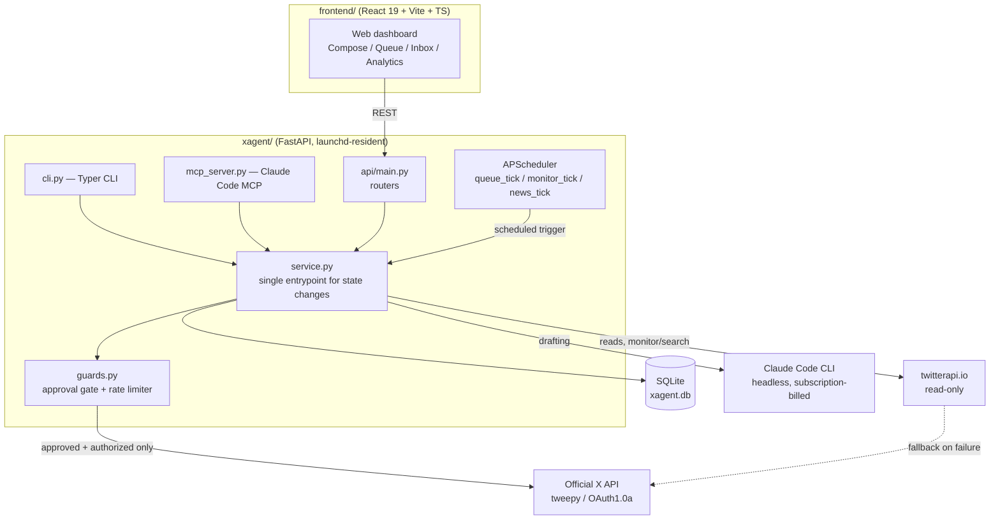

# XAgent

A human-in-the-loop assistant that turns a rough note into an on-brand X (Twitter) post, then waits for your approval before it ever touches the send button.

[English](README.md) | [日本語](README.ja.md) | [中文](README.zh.md)


## Why

Running a personal X account seriously means posting often, in a consistent voice, without spending all day writing. Fully automated tools solve the time problem but create a worse one: unattended bots that like, follow, retweet, or reply at scale are exactly what X's anti-spam systems are built to catch, and they can get an account suspended. Existing "AI growth" tools tend to lean into that risk in exchange for speed.

XAgent takes the opposite trade: let AI do the drafting (rephrasing a rough note into your voice, drafting a reply, picking the day's engagement candidates), but keep every action that actually touches your account behind an explicit human approval. It also does the parts that are legitimately tedious and mechanical — computing X's real weighted character count, splitting long text into a thread, spacing out posting frequency — without asking an LLM to get arithmetic right.

## Features

- **Draft → Approve → Post, enforced in code, not just by convention.** Every status transition (`draft → approved → queued → posted`, plus reject/cancel) is validated against an explicit allow-list (`xagent/guards.py`). An invalid transition — including any attempt to post something that was never approved — raises `PolicyViolation` before it reaches the X API.
- **No automated engagement.** By design, XAgent never auto-likes, auto-follows, auto-retweets, or bulk-replies. The monitoring daemon only *drafts* reply/quote candidates for a human to review; it cannot post them itself.
- **Two-gate posting authorization.** A draft can only be sent through one of two paths: a human explicitly clicking "post" (`MANUAL`), or a scheduler firing on a draft that is already `QUEUED` **and** has a `scheduled_at` timestamp that has already passed (`SCHEDULED`). A queued draft with no schedule, or one whose time hasn't arrived, is never auto-posted — this is the guard against silent misfires.
- **Built-in rate limiting.** A pure, DB-independent `RateLimiter` enforces a soft daily cap (default 10/day), a hard cap (default 100/day), and a minimum interval between posts (default 300s) — tuned to stay inside what looks like normal human posting behavior.
- **Quiet hours (blackout).** Public writes can be blocked during configured weekday hours (e.g. work hours); reading/monitoring is unaffected. Bypassing blackout requires an explicit two-step override.
- **Self-implemented X weighted character counter.** X counts Latin characters as weight 1 and CJK/emoji as weight 2, with a 280-weighted-unit limit — not a copy-paste of an external library, `xagent/text.py` implements the weighting table and thread-splitting logic directly, with unit tests.
- **Official API for writes, cheap API for reads.** Anything that touches *your own* account (post, retweet, list management) goes through the official X API (`tweepy`, OAuth1.0a) only. Reading other people's posts (monitoring, search, style learning) is routed through the cheaper `twitterapi.io`, with automatic fallback to the official API on failure — because unofficial write access to your own account is a ban risk, but unofficial *read* access carries none.
- **A hard kill switch.** `posting_enabled=false` stops all posting — manual and scheduled — immediately, and overrides every other gate.
- **Web dashboard, CLI, and MCP, one service layer.** The React SPA, the Typer CLI, and an MCP server for Claude Code all call the same `xagent.service` layer, so the guarantees above apply no matter which surface you use.

## Architecture



All three entry points — the Web UI, the CLI, and the MCP server used from Claude Code — call the same `xagent.service` layer, so the approval gate and rate limiter in `guards.py` apply uniformly no matter how a draft was created or posted. The backend is a single FastAPI process; an in-process APScheduler (not a separate daemon) runs the recurring jobs that fire scheduled posts and generate draft engagement candidates.

## Tech Stack

**Backend**: Python 3.11+, FastAPI, SQLModel (SQLite), APScheduler, Typer, tweepy, httpx, FastMCP
**Frontend**: React 19, TypeScript, Vite, Tailwind CSS, shadcn/ui
**AI**: Claude Code CLI (headless one-shot sessions, subscription-billed — no `ANTHROPIC_API_KEY` / pay-per-token usage)
**External APIs**: X API v2 (official, writes + fallback reads), twitterapi.io (unofficial, reads only)

## Getting Started

### Prerequisites

- Python 3.11+
- Node.js (for the frontend)
- An X Developer Portal app (OAuth1.0a credentials) if you want to actually post
- The [Claude Code CLI](https://docs.claude.com/en/docs/claude-code) installed and logged in (used as the drafting engine)

### Setup

```bash
python3 -m venv .venv
source .venv/bin/activate
pip install -e ".[dev]"

cp env.example .env   # fill in your own API keys — see below
```

You'll need to provide your own credentials in `.env`:

- `X_API_KEY` / `X_API_SECRET` / `X_ACCESS_TOKEN` / `X_ACCESS_TOKEN_SECRET` / `X_BEARER_TOKEN` — from the [X Developer Portal](https://developer.x.com/) (required to actually post)
- `TWITTERAPI_IO_KEY` — optional, from [twitterapi.io](https://twitterapi.io/dashboard) (cheaper reads; without it, reads fall back to the official API)
- Drafting uses the Claude Code CLI you already have installed — no separate API key needed

### Run

```bash
pytest                                          # run the test suite
xagent preview "some long text you want to post"   # structural check, no LLM call
xagent compose "today's idea" && xagent list    # draft via Claude, then list drafts
xagent serve                                    # FastAPI backend: http://127.0.0.1:8000

# in a separate terminal
cd frontend && npm install && npm run dev       # dashboard: http://localhost:5180
```

Key CLI commands: `xagent approve <id>` / `xagent post <id>` / `xagent queue <id> [--at ISO8601]` / `xagent targets-add @handle` / `xagent monitor-once`.

## Project Structure

```
xagent/                Core library, shared by CLI / Web / daemon
  guards.py             Approval gate + rate limiter (the safety backbone)
  service.py             Single entrypoint for all draft/post state changes
  text.py                 X weighted character count + thread splitting
  models.py                SQLModel entities (Draft, DraftStatus, ...)
  x_client.py               Official X API wrapper (tweepy)
  twitterapi_client.py        Read-only twitterapi.io client
  formatter.py                  Claude-backed drafting / selection logic
  claude_cli.py                  Headless Claude Code CLI runner
  scheduler.py / monitor.py       Scheduled posting / engagement monitoring
  api/                              FastAPI app and routers
  cli.py                             Typer CLI
  mcp_server.py                      MCP server for Claude Code
tests/                  pytest suite (25 files)
frontend/               React + Vite + TS dashboard
docs/PROJECT_OVERVIEW.md  Full internal design reference
```

## Testing

```bash
pytest              # full backend suite (25 test files)

cd frontend
npm run typecheck   # TypeScript check
```

`tests/test_guards.py` covers the approval state machine and rate limiter in isolation from any network or LLM call — the safety-critical logic is fully unit-testable by design.

## Status

Actively used for the maintainer's own personal X account. The core loop (compose → approve → post), the approval/rate-limit guards, the scheduler, and the monitoring daemon are implemented and covered by tests. This is a single-operator personal tool, not a multi-tenant SaaS product — expect to read the code and adjust config (e.g. rate limits, blackout hours, prompts) for your own account before relying on it.

## License

MIT — see [LICENSE](LICENSE).
