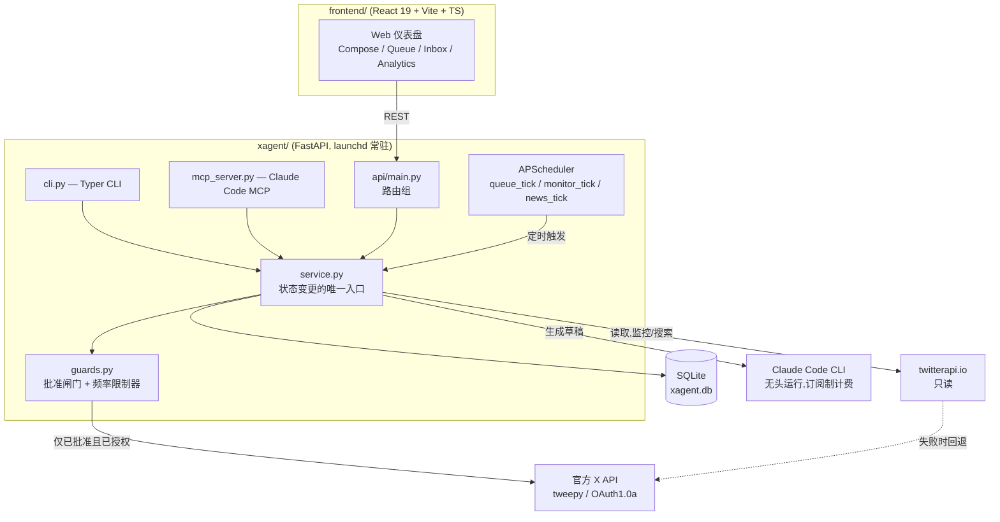

# XAgent

一个人机协作的助手：把一段粗略的文字整理成符合你个人风格的 X(Twitter)帖子，在真正发出之前始终等待你的批准。

[English](README.md) | [日本語](README.ja.md) | [中文](README.zh.md)


## Why(为什么做这个)

认真运营个人 X 账号,意味着要用一致的语气频繁发帖,却又不能把一整天都花在写文案上。全自动工具解决了时间问题,却制造了更糟的问题——无人值守地点赞、关注、转发或批量回复,正是 X 的反垃圾信息系统重点打击的行为,严重时会导致账号被封。市面上不少"AI 涨粉"工具,为了速度而选择承担这种风险。

XAgent 走的是相反的路线:让 AI 负责起草(把粗略的想法改写成你的语气、写回复草稿、挑选当天的互动候选),但任何真正作用于账号的操作,都必须先经过人类的明确批准。同时,那些确实繁琐又机械的部分——计算 X 真实的加权字符数、把长文拆分成串联帖、控制发帖频率——也都是自己实现的,不依赖 LLM 去做算术。

## Features(主要功能)

- **草稿 → 批准 → 发布,由代码强制执行,而非仅靠约定。** 每一次状态迁移(`draft → approved → queued → posted`,以及拒绝/取消)都会对照一份显式的允许列表(`xagent/guards.py`)进行校验。任何非法迁移——包括试图发布从未被批准的内容——都会在到达 X API 之前抛出 `PolicyViolation`。
- **不做任何自动互动。** 按设计,XAgent 绝不会自动点赞、自动关注、自动转发或批量回复。监控守护进程只会为人工审核**生成**回复/引用候选草稿,它本身无法发布这些内容。
- **发布只有两条授权路径。** 草稿只能通过以下两种方式之一被发送:人类明确点击"发布"(`MANUAL`);或调度器在草稿已处于 `QUEUED` 状态**且** `scheduled_at` 预定时间已到达时触发(`SCHEDULED`)。没有预定时间的排队草稿,或时间尚未到达的草稿,永远不会被自动发布——这是防止误发的关键机制。
- **内置发帖频率限制。** 一个不依赖数据库、纯函数式的 `RateLimiter` 负责判定每日建议上限(默认 10 条)、硬上限(默认 100 条)以及连续发帖的最小间隔(默认 300 秒),参数经过调校以贴近正常人类的发帖行为。
- **免打扰时段(黑名单)。** 可以在设定的工作日时段(例如上班时间)阻止公开写入操作,读取/监控不受影响。要绕过该限制,需要经过明确的两步确认。
- **自研的 X 加权字符计数器。** X 将拉丁字符计为权重 1,将中日韩字符/表情符号计为权重 2,上限为加权 280。`xagent/text.py` 并非照搬外部库,而是直接实现了权重表和串联帖拆分逻辑,并配有单元测试。
- **写操作走官方 API,读操作走廉价 API。** 任何作用于**自己**账号的操作(发帖、转发、列表管理)都只通过官方 X API(`tweepy`、OAuth1.0a)。读取他人的帖子(监控、搜索、风格学习)优先走更便宜的 `twitterapi.io`,失败时自动回退到官方 API——因为用非官方接口写入自己的账号有封号风险,但非官方的**读取**不存在这个风险。
- **硬性紧急停止开关。** `posting_enabled=false` 会立即停止所有发布(无论手动还是定时),优先级高于其他所有防护机制。
- **Web 仪表盘、CLI、MCP 共用同一个服务层。** React 单页应用、Typer 编写的 CLI,以及供 Claude Code 使用的 MCP 服务器,全部调用同一个 `xagent.service` 层,因此无论使用哪个入口,上述保证都同样适用。

## Architecture(架构)



Web UI、CLI,以及在 Claude Code 中使用的 MCP 服务器这三个入口,都调用同一个 `xagent.service` 层。因此 `guards.py` 中的批准闸门和频率限制器,无论草稿是通过哪个入口创建或发布,都会一致地生效。后端是单一的 FastAPI 进程;定时发布、生成互动候选等周期性任务由进程内置的 APScheduler(而非独立的守护进程)负责运行。

## Tech Stack(技术栈)

**后端**: Python 3.11+, FastAPI, SQLModel (SQLite), APScheduler, Typer, tweepy, httpx, FastMCP
**前端**: React 19, TypeScript, Vite, Tailwind CSS, shadcn/ui
**AI**: Claude Code CLI(无头一次性会话,订阅制计费——不使用 `ANTHROPIC_API_KEY` 或按量计费)
**外部 API**: X API v2(官方,写入+回退读取)、twitterapi.io(非官方,仅只读)

## Getting Started(快速开始)

### 前置条件

- Python 3.11+
- Node.js(前端需要)
- 如果要实际发布内容,需要 X 开发者门户的应用凭证(OAuth1.0a)
- 已安装并登录 [Claude Code CLI](https://docs.claude.com/en/docs/claude-code)(用作起草引擎)

### 安装步骤

```bash
python3 -m venv .venv
source .venv/bin/activate
pip install -e ".[dev]"

cp env.example .env   # 填入你自己的 API 密钥(见下文)
```

你需要在 `.env` 中提供自己的凭证:

- `X_API_KEY` / `X_API_SECRET` / `X_ACCESS_TOKEN` / `X_ACCESS_TOKEN_SECRET` / `X_BEARER_TOKEN` — 从 [X 开发者门户](https://developer.x.com/) 获取(要实际发布内容则必填)
- `TWITTERAPI_IO_KEY` — 可选,从 [twitterapi.io](https://twitterapi.io/dashboard) 获取(用于更便宜的读取;不设置则读取会回退到官方 API)
- 起草功能使用你已安装的 Claude Code CLI——无需额外的 API 密钥

### 运行

```bash
pytest                                          # 运行测试套件
xagent preview "你想发布的一段较长文字"            # 结构检查,不调用 LLM
xagent compose "今天的想法" && xagent list        # 通过 Claude 起草,然后列出草稿
xagent serve                                    # FastAPI 后端: http://127.0.0.1:8000

# 在另一个终端中
cd frontend && npm install && npm run dev       # 仪表盘: http://localhost:5180
```

常用 CLI 命令: `xagent approve <id>` / `xagent post <id>` / `xagent queue <id> [--at ISO8601]` / `xagent targets-add @handle` / `xagent monitor-once`。

## Project Structure(项目结构)

```
xagent/                核心库(CLI / Web / 守护进程共用)
  guards.py             批准闸门 + 频率限制器(安全机制的核心)
  service.py             草稿/发布状态变更的唯一入口
  text.py                 X 加权字符计数 + 串联帖拆分
  models.py                SQLModel 实体(Draft, DraftStatus, ...)
  x_client.py               官方 X API 封装(tweepy)
  twitterapi_client.py        只读的 twitterapi.io 客户端
  formatter.py                  基于 Claude 的起草/筛选逻辑
  claude_cli.py                  无头 Claude Code CLI 运行器
  scheduler.py / monitor.py       定时发布 / 互动监控
  api/                              FastAPI 应用与路由
  cli.py                             Typer CLI
  mcp_server.py                      供 Claude Code 使用的 MCP 服务器
tests/                  pytest 测试套件(25 个文件)
frontend/               React + Vite + TS 仪表盘
docs/PROJECT_OVERVIEW.md  完整的内部设计参考文档
```

## Testing(测试)

```bash
pytest              # 完整后端测试套件(25 个文件)

cd frontend
npm run typecheck   # TypeScript 类型检查
```

`tests/test_guards.py` 在不依赖网络或 LLM 调用的情况下,独立验证批准状态机和频率限制器——这类关乎安全的逻辑,按设计天生就可以完整地做单元测试。

## Status(完成度)

目前正用于维护者本人的个人 X 账号日常运营。核心流程(整理 → 批准 → 发布)、批准/频率防护、调度器和监控守护进程均已实现并有测试覆盖。这是一个面向单一运营者的个人工具,而非多租户 SaaS 产品——在依赖它之前,预期你会阅读代码,并针对自己的账号调整配置(例如频率上限、免打扰时段、提示词等)。

## License(许可证)

MIT — 详见 [LICENSE](LICENSE)。
